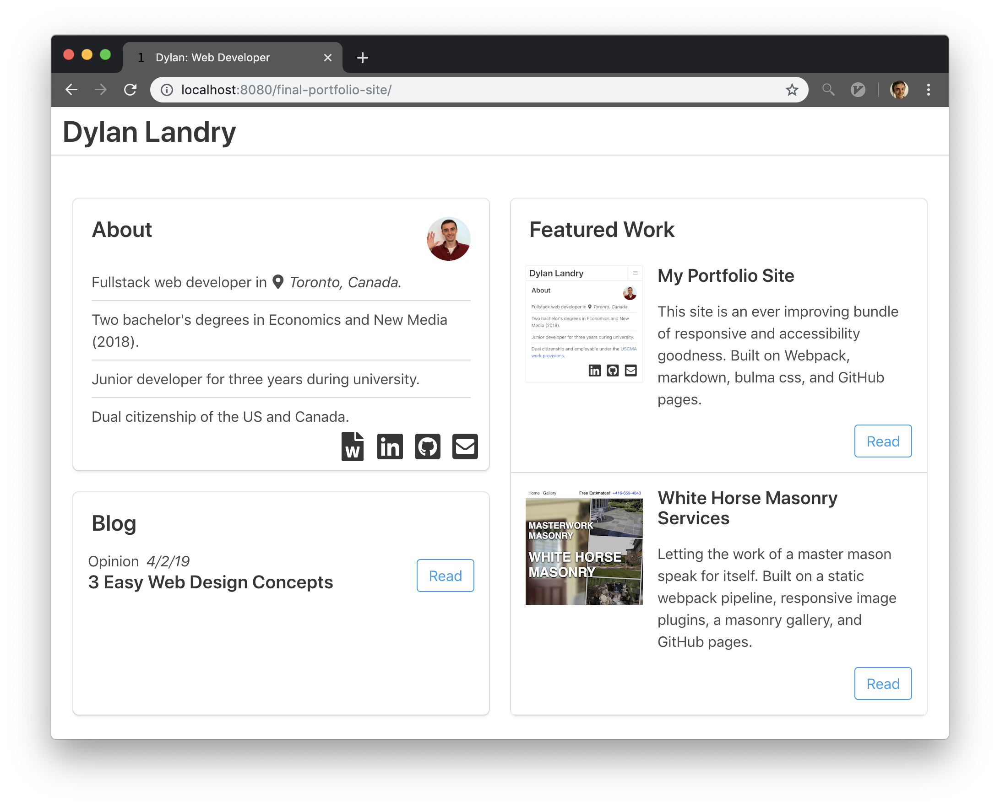

# Final Portfolio Site
A webpack static site builder for Dylan Landry's portfolio site.

[Github Repository](https://github.com/dyllandry/final-portfolio-site)



## Scripts
- Begin webpack dev server: `npm start`
- Build to `dist/` dir: `npm run build`

## Adding Post Pages
1. Create a new directory for your post in `./src/posts/`, e.g. `./src/posts/first-post/`
1. In this directory, place a thumbnail image named `thumbnail` with any image extension, e.g. `./src/posts/first-post/thumbnail.png`
1. In this directory, create a markdown file, e.g. `./src/posts/first-post/markdown.md`. 
1. Follow this  format for writing the markdown file's contents. Replace <> with your values (remove the <> characers after).
    ```
    ---
    <attribute>: <value>
    <another attribute>: <another value>
    ---
    Write your markdown here.
    ```

### Attributes and Values
Attributes shape how the post is described on the home page.

<small>\* *Some attributes are only applicable to a specific category of post, e.g. featured or blog.*</small>

attribute | value | meaning | applicable to category
--- | --- | --- | ---
category | 'featured' or 'blog'| Whether to list the post in the featured list or the blog list. | featured, blog 
title | string | Title to appear in lists. | featured, blog
description | string | Description to appear in lists. | featured
date | string | Date of the post. | blog
subCategory | string | Subcategory of post to appear in list, e.g. tutorial, opinion, etc. | blog

## Notable Project Characteristics
1. Adding more posts is relatively easy and the necessary build pipeline is integrated with webpack. The workflow is not easy enough for non-developers to follow, though that wasn't one of my goals. The remaining complexity lets me do some detailed editing that wouldn't otherwise be possible with what more simplified workflows I can currently think of.
1. The design is clean and simple, though I might restructure how navigation works. My efforts to simplify the site's information onto one page and my navigation bar design ended up creating an unintuitive experience. 
1. While this is a neat custom static site build pipeline I made, and it was great as a learning tool, maintaining it and adding additional features is time consuming. Next time, I'd rather implement a prexisting CMS and static page builder so I can focus my time on more unique features than static site building itself.